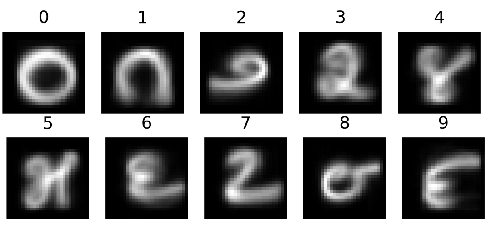

# Kannada-MNIST
This is project for APPLIED ARTIFICIAL IINTELLIGENCE Module at SRH Heidelberg


## Overview

Kannada is my Mothertongue and is a language spoken predominantly by people of Karnataka in southwestern India. The language has roughly 45 million native speakers and is written using the Kannada script [Wikipedia](https://en.wikipedia.org/wiki/Kannada).



The digital handwritten dataset, termed Kannada-MNIST was released on 3rd August 2019 [paper](https://arxiv.org/pdf/1908.01242.pdf). The github repo of the author can be found [here.](https://github.com/vinayprabhu/Kannada_MNIST).

This project aims at classifying Kannada digits using Convolutional Neural Network. 

Google Cloud Platform is used for training of the Deep learning model and deployed using Jupyter Notebook. The Dataset is mounted with Google drive. Google's Deeplearning framework, Keras is used for model creation.


## Dependencies
This project has the following dependencies: 
```
Numpy
Pandas
Scikit-learn 
Keras 
Tensorflow 
Google Cloud Platform
Jupyter Notbook

```
## Dataset


The training data set contains 60000 rows with 785 columns. Labels are provided in the first column. That is my target value. Here it is numbers from 0 to 9. I have plotted the  bar graph in Jupyter Notebook to see the distribution of this target value. Pixel0 to Pixel783: These are the pixel values of the image metrics representing pixel position in the image metric.
The Testing data is similar to training dataset but with no labels


## Usage

## Procedure to train and test

The data set must be downloaded from these links 
[train.csv](https://drive.google.com/file/d/1QV5E44utfjY-PBLRTfQr0wO2spgIPDHW/view?usp=sharing).
[train.csv](https://drive.google.com/file/d/1fk1HiVuTCx54wpIAeFU2p4mkYyM_-OBm/view?usp=sharing).

and saved in Google Drive. Some of the changes must be made according to documentation written in Jupyter Notebook.

## Credits

Vinay Prabhu for providing dataset through his [Repo](https://github.com/vinayprabhu/Kannada_MNIST)

